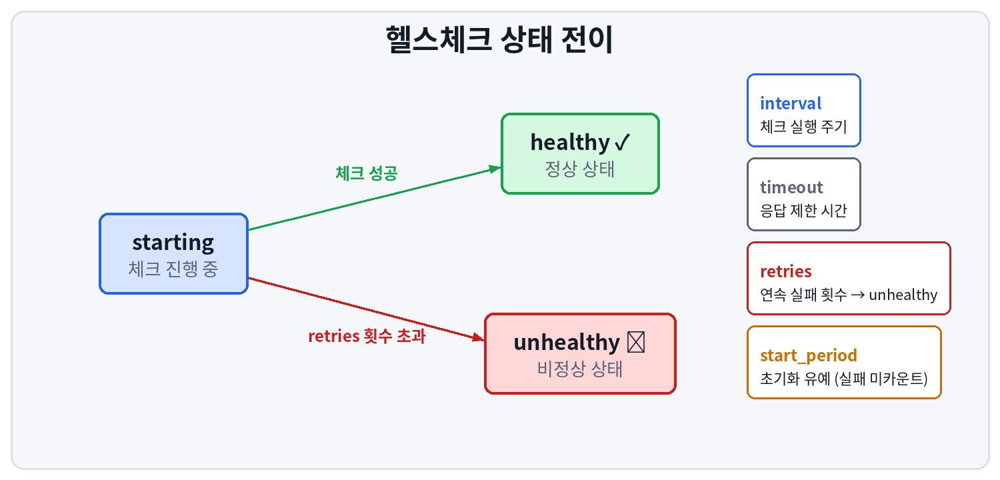
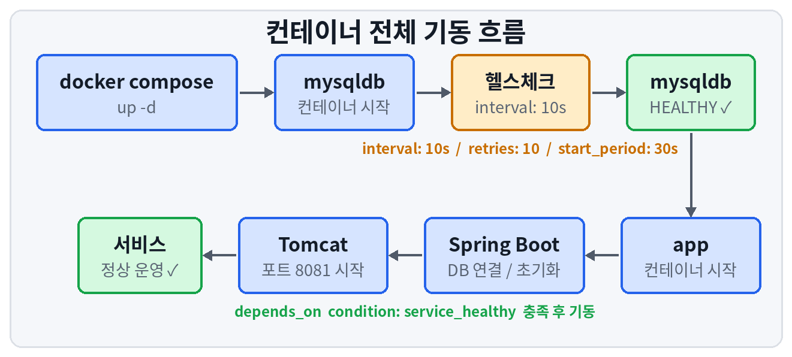
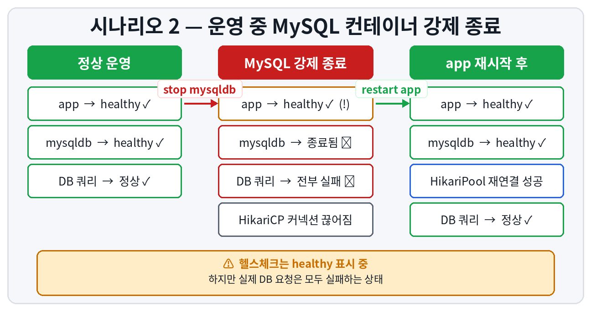

# Docker Compose — Spring Boot와 MySQL 컨테이너 의존성 및 헬스체크 탐구

Docker Compose 환경에서 Spring Boot와 MySQL 다중 컨테이너를 구성하면서, **"컨테이너가 시작된 상태"와 "서비스가 실제로 사용 가능한 상태"가 왜 구분되어야 하는가**를 다양한 시나리오를 통해 직접 검증한 기록이다.

---

## 탐구 환경

| 항목 | 내용 | 항목 | 내용 |
|---|---|---|---|
| OS | Ubuntu Server | Docker Compose | v2 |
| Spring Boot | 3.5.10 | Java | 17 |
| Spring Boot 이미지 | `qbooo/step-empapp:1.1` | MySQL 이미지 | `mysql:8.0` |
| 빌드 도구 | Gradle | ORM | JPA / Hibernate |

---

## 문제 인식

`depends_on: db`만 설정하면 Docker Compose는 대상 컨테이너의 **프로세스 시작 여부(service_started)** 만 확인한다.  
MySQL 프로세스가 올라왔다고 해서 즉시 쿼리를 처리할 수 있는 상태는 아니며, InnoDB 초기화·권한 설정 등에 수십 초가 소요된다.  
이 간극 때문에 Spring Boot가 MySQL에 접속을 시도했다가 실패하고 비정상 종료되는 문제가 발생한다.

> **해결 방향** — `healthcheck`와 `depends_on condition: service_healthy` 조합으로, MySQL이 실제로 준비된 이후에만 app이 기동되도록 제어한다.

---

## 핵심 개념

<details>
<summary><b>1. Healthcheck — 클릭하여 펼치기</b></summary>

<br>

Docker가 컨테이너 내부에서 주기적으로 명령을 실행하여 서비스 상태를 판별하는 기능이다.



```yaml
healthcheck:
  test: ["CMD-SHELL", "명령어 || exit 1"]
  interval: 10s      # 헬스체크 실행 주기
  timeout: 5s        # 응답 제한 시간 (초과 시 해당 회차 실패 처리)
  retries: 10        # 연속 실패 허용 횟수 (초과 시 unhealthy 판정)
  start_period: 30s  # 초기화 유예 시간 (이 기간의 실패는 카운트 미포함)
```

</details>

<details>
<summary><b>2. depends_on condition — 클릭하여 펼치기</b></summary>

<br>

```yaml
depends_on:
  mysqldb:
    condition: service_healthy   # mysqldb가 healthy 될 때까지 app 시작 블로킹
```

| condition | 동작 |
|---|---|
| `service_started` (기본값) | 컨테이너 프로세스가 시작됐는지만 확인 |
| `service_healthy` | healthcheck가 healthy 판정될 때까지 블로킹 |
| `service_completed_successfully` | 컨테이너가 exit 0으로 종료될 때까지 대기 |

또한 `depends_on`은 단순히 시작 순서만 제어하는 것이 아니라, **의존 서비스가 미기동 상태일 경우 자동으로 함께 기동**시키는 기능도 포함한다.

</details>

<details>
<summary><b>3. 서비스명 = 컨테이너 내부 호스트명 — 클릭하여 펼치기</b></summary>

<br>

Docker Compose는 동일 네트워크 내 컨테이너 간 통신 시 서비스명을 호스트명으로 DNS 해석한다.  
`application.properties`의 datasource URL에 명시된 호스트명과 Compose 파일의 서비스명을 반드시 일치시켜야 한다.

```bash
# application.properties
spring.datasource.url=jdbc:mysql://mysqldb:3306/fisa?...
```

```yaml
# docker-compose.yaml
services:
  mysqldb:   # ← 위의 호스트명과 반드시 일치
    image: mysql:8.0
```

</details>

<details>
<summary><b>4. 볼륨(Volume)과 데이터 영속성 — 클릭하여 펼치기</b></summary>

<br>

`docker compose down`은 컨테이너를 삭제하지만 named volume은 삭제하지 않는다.  
MySQL의 데이터 디렉토리인 `/var/lib/mysql`을 named volume에 마운트하면, 컨테이너가 재생성되어도 기존 데이터가 보존된다.

| 명령어 | 컨테이너 | 볼륨 |
|---|---|---|
| `docker compose down` | 삭제 ✅ | 보존 ✅ |
| `docker compose down -v` | 삭제 ✅ | 삭제 ✅ |

</details>

---

## 최종 구성 파일

<details>
<summary><b>application.properties — 클릭하여 펼치기</b></summary>

<br>

```bash
spring.application.name=step04_empApp

server.servlet.context-path=/emp
server.port=8081

spring.datasource.driver-class-name=com.mysql.cj.jdbc.Driver
spring.datasource.url=jdbc:mysql://mysqldb:3306/fisa?serverTimezone=Asia/Seoul&useSSL=false&allowPublicKeyRetrieval=true
spring.datasource.username=user01
spring.datasource.password=user01

spring.jpa.hibernate.ddl-auto=update
spring.jpa.database-platform=org.hibernate.dialect.MySQLDialect
spring.jpa.show-sql=true
spring.jpa.properties.hibernate.format_sql=true
```

</details>

<details>
<summary><b>docker-compose.yaml — 클릭하여 펼치기</b></summary>

<br>

```yaml
services:
  mysqldb:
    image: mysql:8.0
    restart: always
    ports:
      - "3306:3306"
    environment:
      MYSQL_ROOT_PASSWORD: root
      MYSQL_DATABASE: fisa
      MYSQL_USER: user01
      MYSQL_PASSWORD: user01
    volumes:
      - db_data:/var/lib/mysql
    networks:
      - spring-mysql-net
    healthcheck:
      test: ["CMD-SHELL", "mysqladmin ping -h localhost -u root -p$$MYSQL_ROOT_PASSWORD || exit 1"]
      interval: 10s
      timeout: 5s
      retries: 10
      start_period: 30s

  app:
    image: qbooo/step-empapp:1.1
    restart: always
    ports:
      - "8081:8081"
    depends_on:
      mysqldb:
        condition: service_healthy
    networks:
      - spring-mysql-net
    healthcheck:
      test: ["CMD-SHELL", "curl -f http://localhost:8081/emp || exit 1"]
      interval: 30s
      timeout: 10s
      retries: 3
      start_period: 60s

volumes:
  db_data:

networks:
  spring-mysql-net:
```

> `$$MYSQL_ROOT_PASSWORD` — Compose 파일에서 `$`를 리터럴로 전달하려면 `$$`로 이스케이프해야 한다. `$`만 사용하면 Compose가 자신의 변수로 해석한다.

</details>

---

## 전체 기동 흐름



---

## 발생한 문제 및 해결

<details>
<summary><b>문제 1. docker compose down 시 네트워크 삭제 불가 — 클릭하여 펼치기</b></summary>

<br>

**증상**

```
! Network 02compose_spring-mysql-net Resource is still in use
```

**원인**

Compose 파일에서 서비스명을 `db` → `mysqldb`로 변경한 후 `down`을 실행했을 때,  
기존 서비스명(`db`)으로 생성된 컨테이너(`02compose-db-1`)가 네트워크에 잔류한 채 Compose 관리 범위에서 벗어나 orphan 상태가 된 것이 원인이다.

**해결**

```bash
docker compose down --remove-orphans
```

`--remove-orphans` — 현재 Compose 파일에 정의되지 않은 orphan 컨테이너를 함께 정리한다.

</details>

<details>
<summary><b>문제 2. docker exec 실행 시 컨테이너를 찾지 못함 — 클릭하여 펼치기</b></summary>

<br>

**증상**

```
Error response from daemon: container mysqldb is not running
```

**원인**

`docker exec`의 대상은 서비스명이 아닌 실제 컨테이너명이다.  
Docker Compose가 생성하는 컨테이너명은 `{프로젝트명}-{서비스명}-{인덱스}` 형식을 따른다.

**해결**

```bash
# 컨테이너명 확인
docker compose ps

# 정확한 컨테이너명으로 접속
docker exec -it 02compose-mysqldb-1 mysql -u user01 -pfisa
```

</details>

<details>
<summary><b>문제 3. docker compose -d --build 명령어 오류 — 클릭하여 펼치기</b></summary>

<br>

**원인**

`up` 서브커맨드가 누락된 잘못된 명령어다.  
또한 `--build`는 Compose 파일에 `build:` 키가 정의된 경우에만 유효하며, `image:`로 기존 이미지를 참조하는 경우에는 불필요하다.

**해결**

```bash
docker compose up -d
```

</details>

---

## 시나리오 검증

### 시나리오 1. MySQL 없이 app만 단독 기동 (`--no-deps`)

**목적** — `depends_on`의 자동 의존 서비스 기동 동작을 우회하여, MySQL이 없는 상태에서 app만 단독 기동했을 때의 동작을 검증한다.

```bash
docker compose down --remove-orphans
docker compose up -d --no-deps app   # --no-deps: 의존 서비스 무시하고 단독 기동
docker compose ps
```

<!-- 스크린샷: docker compose ps 및 로그 캡처 -->

**결과**

컨테이너 자체는 기동됐으나, Spring Boot가 `mysqldb` 호스트를 Docker DNS에서 찾지 못해 JPA EntityManagerFactory 초기화에 실패하고 애플리케이션이 비정상 종료됐다.

```
Caused by: java.net.UnknownHostException: mysqldb
```

**Crash Loop 발생**

`restart: always` 설정으로 인해 컨테이너가 재시작되지만, MySQL이 없는 이상 매번 동일한 이유로 종료된다.  
헬스체크는 `start_period` 내에 앱이 종료되어버리므로 영원히 `health: starting` 상태를 유지하는 무한 재시작 루프(Crash Loop)에 빠진다.

<details>
<summary>오류 흐름 상세 — 클릭하여 펼치기</summary>

<br>

```
Spring Boot 기동
  → Hibernate DDL 실행을 위해 DB 연결 시도
  → HikariCP (Hikari Connection Pool)가 mysqldb:3306 접속 시도
  → Docker DNS에서 mysqldb 조회 실패 (UnknownHostException)
  → JPA EntityManagerFactory 초기화 실패
  → Spring Boot 전체 기동 실패 → 컨테이너 종료
  → restart: always → 재기동 → 반복 (Crash Loop) ♻️
```

</details>

**결론** — `depends_on condition: service_healthy`는 MySQL이 준비되기 전에는 app 기동을 원천 차단하여 위와 같은 Crash Loop 상황 자체를 방지한다.

---

### 시나리오 1-2. 볼륨 영속성 검증

볼륨 영속성 검증 — 컨테이너 삭제 후 재생성

**목적** — 컨테이너를 완전히 삭제하고 새로 생성했을 때 기존 데이터가 보존되는지 검증한다.

**실행**
```bash# 
컨테이너 전체 삭제 (볼륨은 유지)
docker compose down

# 새로 기동
docker compose up -d

# DB 접속하여 데이터 확인
docker exec -it 02compose-mysqldb-1 mysql -u user01 -pfisa

# MySQL 접속 후
use fisa;
show tables;
select * from dept;
```

**결과**

컨테이너를 완전히 삭제하고 새로 생성했음에도 불구하고, `fisa` 데이터베이스와 기존 테이블 및 데이터가 그대로 보존되어 있었다.
```
+----------------+
| Tables_in_fisa |
+----------------+
| dept           |
| emp            |
| emp2           |
+----------------+
```
**원인**

docker compose down은 컨테이너를 삭제하지만 named volume인 db_data는 삭제하지 않는다. MySQL의 실제 데이터가 저장되는 /var/lib/mysql 디렉토리가 db_data 볼륨에 마운트되어 있기 때문에, 컨테이너가 삭제되어도 데이터는 볼륨에 그대로 잔류한다. 새 컨테이너가 기동될 때 동일한 볼륨을 마운트하므로 기존 데이터가 자동으로 복원된다.
```
yamlvolumes:
  - db_data:/var/lib/mysql   # 컨테이너가 삭제돼도 db_data 볼륨은 유지됨
```

| 명령어 | 컨테이너 | 볼륨(데이터) |
| :--- | :---: | :---: |
| `docker compose down` | 삭제 | **보존** |
| `docker compose down -v` | 삭제 | **삭제** |

---


### 시나리오 2. 정상 운영 중 MySQL 컨테이너 강제 종료

**목적** — 정상 운영 중 MySQL이 갑자기 다운됐을 때 app 컨테이너의 상태와 동작을 검증한다.

```bash
docker compose up -d
docker compose stop mysqldb
docker compose ps
docker compose logs -f app
```



<!-- 스크린샷: mysqldb stop 후 docker compose ps 및 HikariCP 에러 로그 캡처 -->

**핵심 결과 요약**

| 항목 | 상태 |
|---|---|
| app 컨테이너 | 실행 중 ✅ |
| app 헬스체크 | healthy ✅ (!) |
| DB 커넥션 풀 | 전부 끊어짐 ❌ |
| 실제 DB 요청 | 전부 실패 ❌ |

앱 프로세스가 살아있더라도 실제 서비스가 불가능한 상태일 수 있다.  
이것이 단순 프로세스 생존 헬스체크의 한계다.

---

### 시나리오 3. MySQL 재기동 후 자동 재연결 여부 확인

**목적** — MySQL이 재기동됐을 때 app이 자동으로 재연결되는지 검증한다.

```bash
docker compose start mysqldb
docker compose logs --tail=20 app
```

<!-- 스크린샷: mysql start 후 app 로그 (UnknownHostException 및 재시작 후 성공 로그 캡처) -->

**결과** — MySQL은 `healthy`로 복구됐으나, app은 여전히 `mysqldb` 호스트를 찾지 못하는 에러를 반복했다.

```
Caused by: java.net.UnknownHostException: mysqldb: Temporary failure in name resolution
```

<details>
<summary>원인 — JVM DNS 캐시 — 클릭하여 펼치기</summary>

<br>

JVM(Java Virtual Machine, 자바 가상 머신)은 한 번 실패한 DNS 조회 결과를 일정 시간 캐시한다.  
MySQL이 재기동되어 네트워크에 다시 참여했어도, app의 JVM은 캐시된 실패 결과를 계속 참조하여 `mysqldb`를 찾지 못한다.

</details>

**해결 — app 재시작으로 JVM DNS 캐시 초기화**

```bash
docker compose restart app
```

**재연결 성공 로그**

```
HikariPool-1 - Start completed.
Started Step04EmpAppApplication in 16.64 seconds
```

---

## 고찰

| 항목 | 내용 |
|---|---|
| Compose 헬스체크 한계 | `unhealthy`는 컨테이너 재시작 트리거가 아님. 프로세스가 죽어야만 `restart: always`가 동작함 |
| Actuator 도입 필요성 | `/actuator/health` 엔드포인트는 DB·디스크 등 실제 의존성 상태까지 포함하여 판별 가능 |
| Kubernetes 오케스트레이터 | `livenessProbe` / `readinessProbe`로 비정상 Pod 자동 감지 및 재시작 가능. MySQL 재기동 후 수동 개입 없이 자동 복구됨 |

<details>
<summary>Actuator 도입 방법 — 클릭하여 펼치기</summary>

<br>

```bash
# build.gradle에 추가
implementation 'org.springframework.boot:spring-boot-starter-actuator'
```

```yaml
# docker-compose.yaml healthcheck 변경
test: ["CMD-SHELL", "curl -f http://localhost:8081/actuator/health || exit 1"]
```

응답 예시:

```json
{
  "status": "DOWN",
  "components": {
    "db": { "status": "DOWN" },
    "diskSpace": { "status": "UP" }
  }
}
```

</details>

---

## 주요 명령어 참조

| 목적 | 명령어 |
|---|---|
| 전체 서비스 백그라운드 기동 | `docker compose up -d` |
| 의존 서비스 무시하고 단독 기동 | `docker compose up -d --no-deps app` |
| 서비스 상태 확인 | `docker compose ps` |
| 로그 실시간 출력 | `docker compose logs -f app` |
| 최근 로그 N줄 출력 | `docker compose logs --tail=20 app` |
| 헬스 상태 직접 확인 | `docker inspect --format='{{.State.Health.Status}}' 02compose-mysqldb-1` |
| 특정 서비스 재시작 | `docker compose restart app` |
| 특정 서비스 정지 | `docker compose stop mysqldb` |
| 컨테이너 정리 (볼륨 보존) | `docker compose down` |
| orphan 컨테이너 포함 정리 | `docker compose down --remove-orphans` |
| 볼륨까지 완전 삭제 | `docker compose down -v` |

---

## 부록 — JPA ddl-auto 옵션

<details>
<summary>클릭하여 펼치기</summary>

<br>

```bash
spring.jpa.hibernate.ddl-auto=update
```

| 값 | 동작 | 권장 환경 |
|---|---|---|
| `create` | 기동 시 테이블 삭제 후 재생성 | 초기 개발 |
| `create-drop` | 기동 시 생성, 종료 시 삭제 | 테스트 |
| `update` | 변경된 스키마만 반영 (기존 데이터 보존) | 개발 |
| `validate` | 스키마 일치 여부만 검증, 변경 없음 | 운영 |
| `none` | 아무 동작도 수행하지 않음 | 운영 |

`update`는 컬럼 추가는 반영하지만 컬럼 삭제는 반영하지 않는다.  
스키마 마이그레이션이 중요한 운영 환경에서는 **Flyway** 또는 **Liquibase** 사용을 권장한다.

</details>